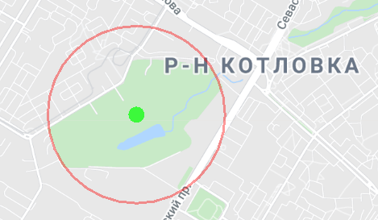
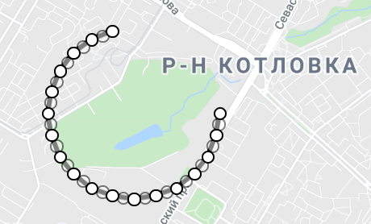

# CirclePolygonDrawer - simple tool to draw near-circle polygons on Google My Maps

Google My Maps does not support shapes (circle, rectangle, etc) nor has public API to draw it programmatically as polygons.
This tool can be used to draw near-circle polygons with selected radius on desktop with JRE (using `java.awt.Robot`)

## Usage

1) Move cursor to green circle at center and adjust radius
2) Select Polygon tool on My Maps panel
3) Click right mouse button on green circle at center

